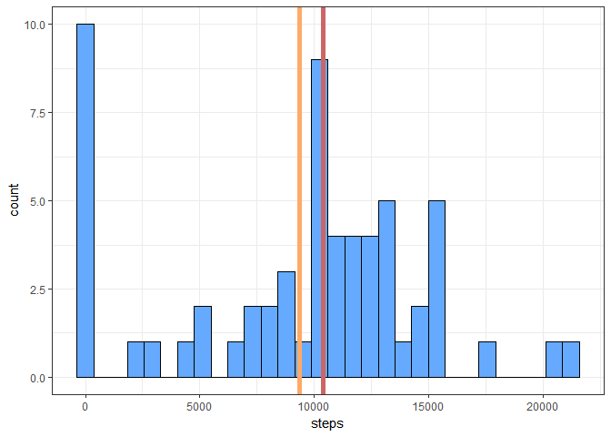
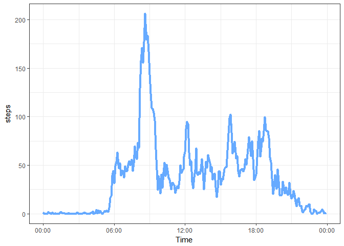
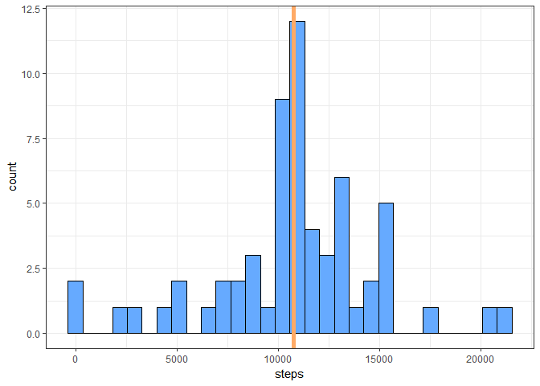
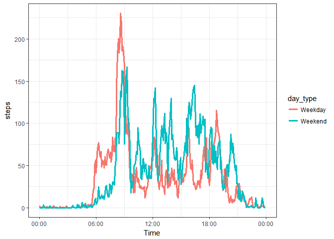

# Reproducible Research: Peer Assessment 1
Aaron W  

Libraries used in this analysis.


```r
library(lubridate)
library(dplyr)
library(stringr)
library(ggplot2)
```

## Loading and preprocessing the data

The activity data is first loaded and preprocessed to convert into date format.


```r
activity <- read.csv("activity.csv")
activity <- rename(activity, datetime = date)
activity <- mutate(activity, interval = str_pad(interval, 4, pad = "0"))
activity <- transmute(activity, steps = steps, datetime = paste(datetime, interval))
activity <- mutate(activity, datetime = parse_date_time(datetime, "ymd HM"))
```

## What is mean total number of steps taken per day?

The activity data is grouped by date, and the total number of steps for each
day is calcualted. Then, the mean and median steps taken per day are found.


```r
steps_per_day <- group_by(activity, date(datetime))
steps_per_day <- summarise(steps_per_day, steps = sum(steps, na.rm = TRUE))
mean_steps <- mean(steps_per_day$steps)
median_steps <- median(steps_per_day$steps)
mean_steps
```

```
## [1] 9354.23
```

```r
median_steps
```

```
## [1] 10395
```

A histogram of the total steps per day is created with the
mean and median steps per day shown as orange and red lines, respectively.


```r
histogram <- ggplot(data = steps_per_day, aes(x = steps))
histogram + geom_histogram(bins = 30, fill = "#66AAFF", color="#000000") +
     theme_bw() + geom_vline(xintercept = mean_steps, color = "#FFAA66", size = 2) + 
     geom_vline(xintercept = median_steps, color = "#CC6666", size = 2)
```

<!-- -->

## What is the average daily activity pattern?
The step data is then grouped by 5 minute intervals and the mean for each day
is calculated. Then, the time when the maximum average steps occurs is found.


```r
daily_activity <- group_by(activity, interval = format(datetime, "%H:%M"))
daily_activity <- summarise(daily_activity, steps = mean(steps, na.rm=TRUE))
maximum <- max(daily_activity$steps)
distinct(filter(daily_activity, steps == maximum))$interval
```

```
## [1] "08:35"
```

The mean for each interval is then plotted as a time series over the course of
the day.


```r
time_series <- ggplot(data = daily_activity, 
                      aes(x = parse_date_time(interval, "HM", select_formats = "*R"), y = steps))
time_series + geom_line(size = 1.5, color = "#66AAFF") + theme_bw() +
     scale_x_datetime(name = "Time", date_labels = "%H:%M")
```

<!-- -->

## Imputing missing values

The number of missing values for the step data is calculated for the dataset.

```r
sum(is.na(activity$steps))
```

```
## [1] 2304
```

Each of the missing data is replaced with the mean for that 5-minute 
interval. The total number of steps per day is then recalculated, and the mean
and median of the data are reported again.


```r
activity$mean_steps <- daily_activity$steps
activity <- mutate(activity, steps = ifelse(is.na(steps), mean_steps, steps))
steps_per_day <- group_by(activity, date(datetime))
steps_per_day <- summarise(steps_per_day, steps = sum(steps, na.rm = TRUE))
mean_steps <- mean(steps_per_day$steps)
median_steps <- median(steps_per_day$steps)
mean_steps
```

```
## [1] 10766.19
```

```r
median_steps
```

```
## [1] 10766.19
```

A histogram of the data that has missing values replaced with the 5-minute 
interval mean is shown below with the mean (and median) steps shown as an orange
line.

```r
histogram <- ggplot(data = steps_per_day, aes(x = steps))
histogram + geom_histogram(bins = 30, fill = "#66AAFF", color="#000000") +
     theme_bw() + geom_vline(xintercept = mean_steps, color = "#FFAA66", size = 2) 
```

<!-- -->

Replacing the missing data with the 5-minute interval mean reduces the number
of days with zero steps, and moves the median so that it is equal to the
mean. This process makes the distribution more centered, although using the mean
for each 5-minute interval for missing values may unrealistically bias the 
results towards the mean.

## Are there differences in activity patterns between weekdays and weekends?

First, a new factor variable that indicates whether a given day is a weekday or
weekend is created in the activity dataset. Then, the data is grouped by 
5-minute interval and day type to find the mean steps taken for each.


```r
activity <- mutate(activity, day_type = 
                        as.factor(ifelse(weekdays(datetime) %in% c("Saturday", "Sunday"), 
                                    "Weekend", "Weekday")))
daily_activity <- group_by(activity, interval = format(datetime, "%H:%M"), day_type)
daily_activity <- summarise(daily_activity, steps = mean(steps, na.rm=TRUE))
```

The data for the weekends and weekdays are then plotted to compare the two.


```r
time_series <- ggplot(data = daily_activity, 
                      aes(x = parse_date_time(interval, "HM", select_formats = "*R"), 
                          y = steps, color = day_type))
time_series + geom_line(size = 1.25) + theme_bw() + 
     scale_x_datetime(name = "Time", date_labels = "%H:%M")
```

<!-- -->

From this plot, weekdays tend to have a large burst in activity in the morning.
In contrast, weekends tend to have more activity spread around the whole day.
